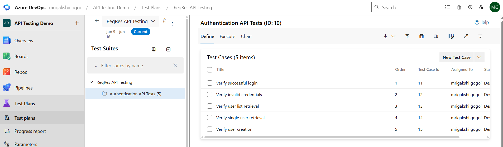

# Azure DevOps Test Management Portfolio

## Project Overview

This project demonstrates hands-on experience with Azure DevOps Test Plans, Test Suites, Test Cases, Test Execution, Defect Tracking, and Requirement Traceability.

The objective of this project is to showcase practical software testing and quality assurance activities using Azure DevOps while following industry-standard testing practices aligned with ISTQB principles.

---

## Project Objectives

* Create and manage Azure DevOps Test Plans
* Organize Test Suites
* Design and maintain Test Cases
* Execute manual tests
* Record test results
* Create and manage defects
* Demonstrate requirement traceability
* Showcase Azure DevOps testing capabilities

---

## Tools Used

| Tool             | Purpose                     |
| ---------------- | --------------------------- |
| Azure DevOps     | Test Management             |
| Azure Boards     | Work Item Management        |
| Azure Test Plans | Test Planning & Execution   |
| GitHub           | Portfolio Hosting           |
| Microsoft Excel  | Test Cases & Defect Reports |
| Markdown         | Documentation               |

---

# Project Structure

```text
azure-devops-test-management/
│
├── README.md
│
├── Documentation/
│   ├── Azure_DevOps_Testing_Guide.pdf
│
├── Test-Cases/
│   └── Login_Test_Cases.xlsx
│
├── Defect-Reports/
│   └── Sample_Bug_Report.xlsx
│
└── screenshots/
    ├── 01-project-created.png
    ├── 02-test-plan-created.png
    ├── 03-test-suite-created.png
    ├── 04-test-case-created.png
    ├── 05-test-run-created.png
    ├── 06-test-results.png
    ├── 07-bug-created.png
    ├── 08-bug-details.png
    ├── 09-user-story-created.png
    ├── 10-traceability-matrix.png
```

---

# Azure DevOps Project Setup

A dedicated Azure DevOps project was created to manage testing activities.

### Project Details

| Property         | Value            |
| ---------------- | ---------------- |
| Project Name     | API Testing Demo |
| Process Template | Agile            |
| Version Control  | Git              |
| Visibility       | Private          |

### Screenshot


---

# Test Plan Creation

A test plan was created to manage the overall testing effort.

### Test Plan

```text
ReqRes API Testing
```

### Purpose

The test plan acts as a central container for all test suites, test cases, test runs, and test results.

### Screenshot


---

# Test Suite Management

Test Suites were created to logically organize test cases.

### Test Suites

```text
User Management APIs
Positive Testing
Negative Testing
```

### Benefits

* Better organization
* Easier reporting
* Structured execution
* Improved traceability

### Screenshot


---

# Test Case Design

Manual test cases were created and maintained within Azure DevOps.

## Sample Test Case

### TC001 – Verify User List Retrieval

#### Steps

1. Send GET request to /api/users?page=2
2. Verify API response
3. Verify status code

#### Expected Result

* Status Code = 200
* User list returned successfully

#### Actual Result

* Status Code = 200
* User list returned successfully

#### Status

Pass

### Screenshot



---

# Test Execution

Test cases were executed using Azure DevOps Test Plans.

### Activities Performed

* Execute manual tests
* Record Pass/Fail results
* Capture execution evidence
* Add execution comments

### Screenshot


---

# Test Results

Test execution results were recorded and tracked.

## Execution Summary

| Metric           | Value |
| ---------------- | ----- |
| Total Test Cases | 10    |
| Passed           | 8     |
| Failed           | 2     |
| Blocked          | 0     |

### Screenshot


---

# Defect Tracking

Defects identified during testing were logged in Azure DevOps Boards.

## Sample Defect

### Bug ID

BUG001

### Title

Login button not responding

### Severity

High

### Priority

High

### Steps to Reproduce

1. Open Login Page
2. Enter valid credentials
3. Click Login

### Expected Result

User successfully logs in.

### Actual Result

No action occurs after clicking Login.

### Screenshot


---

# Defect Details

Detailed bug information was maintained to assist developers with issue resolution.

### Information Captured

* Title
* Description
* Reproduction Steps
* Expected Result
* Actual Result
* Severity
* Priority
* Status

### Screenshot


---

# Azure Boards Integration

User Stories were created and linked with testing activities.

## User Story Example

### Title

User Login Functionality

### Description

As a user,

I want to log into the application

So that I can access my account securely.

### Screenshot


---

# Requirement Traceability

Requirement Traceability was maintained by linking:

```text
User Story
      ↓
Test Case
      ↓
Bug
```

### Benefits

* Requirement coverage
* Audit readiness
* Impact analysis
* Improved quality assurance

### Screenshot


---

# Testing Activities Performed

### Functional Testing

Verification of application functionality against requirements.

### Manual Testing

Execution of predefined test cases.

### Regression Testing

Validation that existing functionality remained unaffected.

### Defect Management

Identification, logging, and tracking of defects.

### Requirement Traceability

Linking requirements with test cases and defects.

---

# Key Learnings

* Azure DevOps Test Plans
* Test Suite Management
* Test Case Design
* Manual Test Execution
* Defect Tracking
* Azure Boards
* Requirement Traceability
* Agile Testing Practices
* ISTQB Testing Techniques

---

# Skills Demonstrated

* Azure DevOps
* Azure Test Plans
* Azure Boards
* Manual Testing
* Test Management
* Test Case Design
* Defect Tracking
* Bug Lifecycle Management
* Agile Methodology
* Requirement Traceability
* Quality Assurance

---

# Author

**Mrigakshi Gogoi**

Certifications:

* Microsoft Certified: Azure Fundamentals (AZ-900)
* Microsoft Certified: Azure Administrator Associate (AZ-104)
* ISTQB Certified Tester Foundation Level (CTFL)

This repository was created to demonstrate practical experience with Azure DevOps Test Management and Software Quality Assurance practices.
