# Azure DevOps & Jira Test Management Portfolio

## Repository Description

This repository demonstrates hands-on experience with Azure DevOps Test Plans, Azure Boards, Jira Defect Management, Test Case Design, Manual Test Execution, Defect Tracking, Agile Testing, and Requirement Traceability.

The project showcases a complete software testing lifecycle from requirements gathering through test execution, defect reporting, retesting, and closure using industry-standard testing tools and methodologies.

---

# Project Objectives

This project was created to demonstrate practical experience in:

* Azure DevOps Test Plans
* Azure Boards
* Test Suite Management
* Test Case Design
* Manual Test Execution
* Jira Defect Management
* Bug Lifecycle Management
* Agile Testing Practices
* Requirement Traceability
* Software Quality Assurance

---

# Tools Used

| Tool             | Purpose                   |
| ---------------- | ------------------------- |
| Azure DevOps     | Test Management           |
| Azure Test Plans | Test Planning & Execution |
| Azure Boards     | Work Item Tracking        |
| Jira Software    | Defect Tracking           |
| GitHub           | Portfolio Hosting         |
| Microsoft Excel  | Test Cases & Bug Reports  |
| Markdown         | Documentation             |
| Postman          | API Testing               |

---


# Azure DevOps Project Setup

A dedicated Azure DevOps project was created to manage testing activities.

## Project Configuration

| Property        | Value            |
| --------------- | ---------------- |
| Project Name    | API Testing Demo |
| Process         | Agile            |
| Visibility      | Private          |
| Version Control | Git              |

## Activities Performed

* Created Azure DevOps project
* Configured Agile process
* Enabled Test Plans
* Configured Azure Boards

## Screenshot

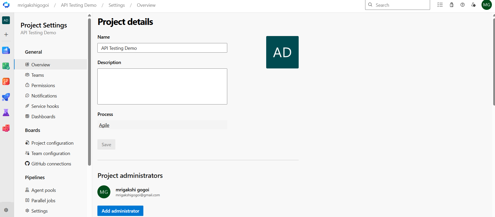

### Configured Azure Boards

- Created Epic, Feature, User Story and Tasks
- Established parent-child relationships
- Demonstrated Agile backlog management
- Implemented requirement traceability

Epic
└── Feature
     └── User Story
          ├── Design Test Cases
          ├── Execute Tests
          ├── Log Defects
          └── Retest Fixed Defects
          
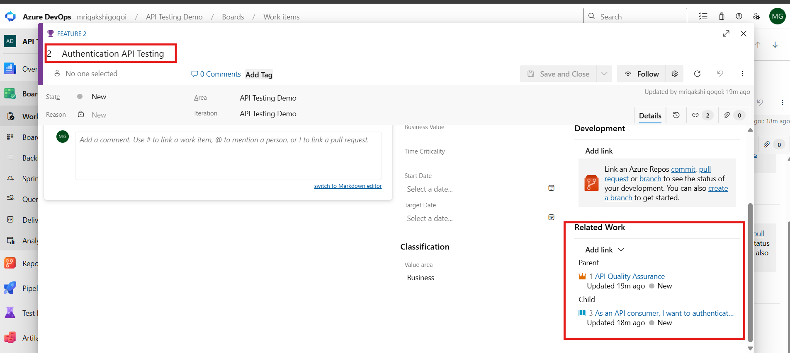

### User Story Breakdown

A User Story was created and decomposed into testing-related tasks to support Agile planning and execution.

Tasks created:

- Design Authentication Test Cases
- Execute Authentication Tests
- Log Authentication Defects
- Retest Fixed Defects

This demonstrates Agile work breakdown, task management, and requirement traceability within Azure Boards.

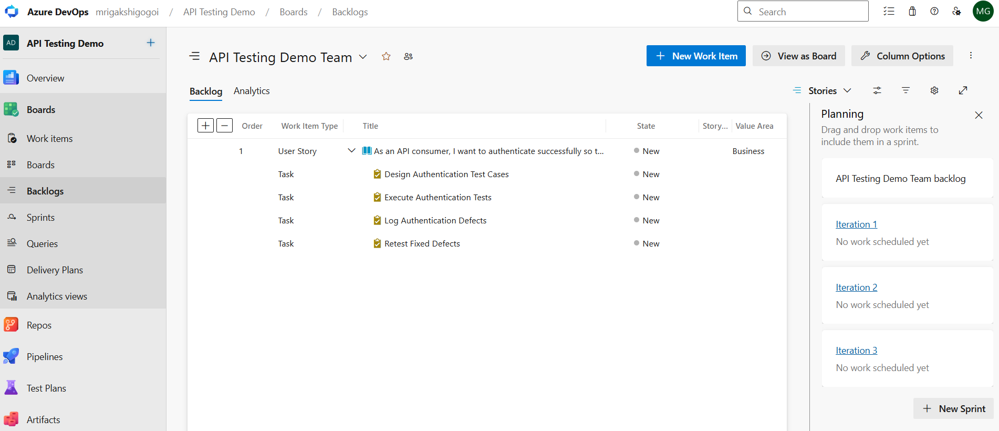
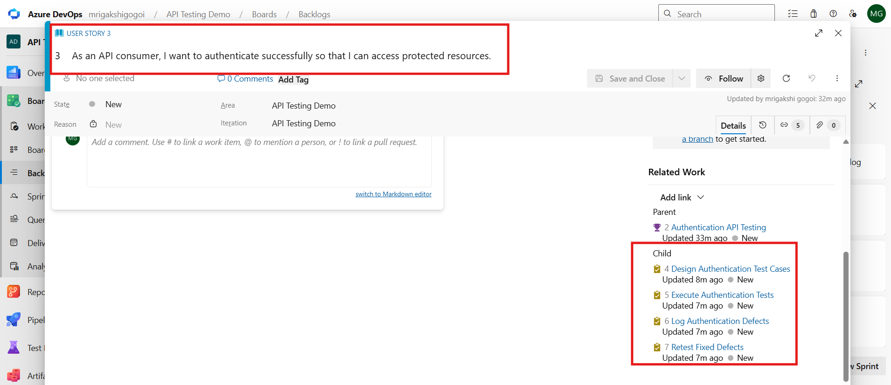

---

# Azure Test Plan Creation

A test plan was created to organize testing activities.

## Test Plan Name

```text
ReqRes API Testing
```

## Purpose

The test plan serves as the primary container for:

* Test Suites
* Test Cases
* Test Runs
* Test Results

## Screenshot

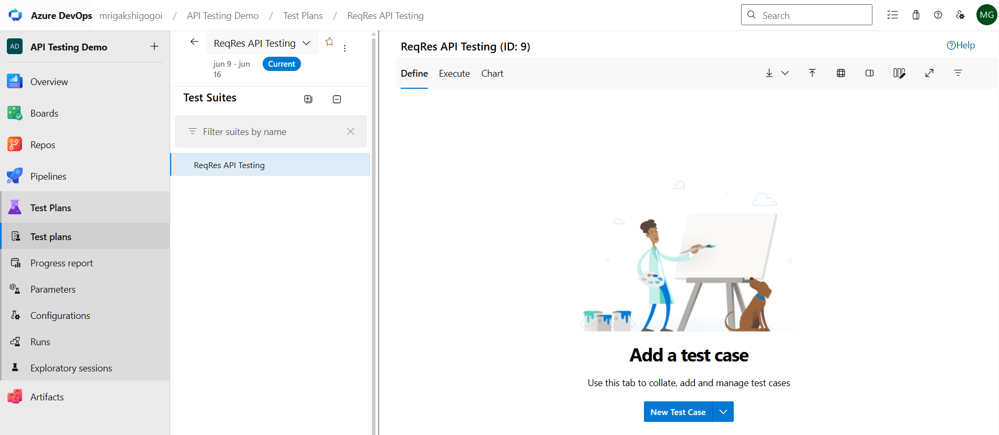


---

# Test Suite Management

Test Suites were created to organize test cases logically.

## Test Suites Created

```text
User Management APIs

Positive Testing

Negative Testing
```

## Benefits

* Better organization
* Easier maintenance
* Improved reporting
* Simplified execution

## Screenshot


---

# Test Case Design

Manual test cases were designed and maintained within Azure DevOps.

## Sample Test Case

### TC001 - Verify User List Retrieval

#### Test Steps

1. Send GET request to /api/users?page=2
2. Verify status code
3. Verify user data returned

#### Expected Result

* Status Code = 200
* User data returned successfully

#### Actual Result

* Status Code = 200
* User data returned successfully

#### Status

Pass

## Screenshot

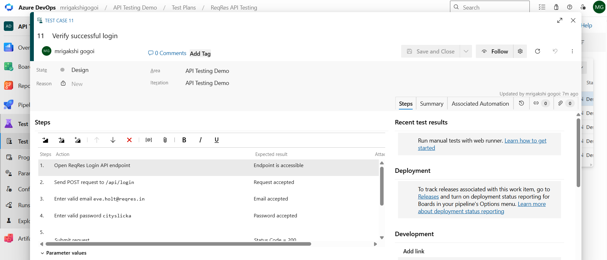

### Test Execution – Verify Successful Login

Tool Used:
Postman

API Endpoint:
POST https://reqres.in/api/login

Request Payload:

{
"email": "[eve.holt@reqres.in](mailto:eve.holt@reqres.in)",
"password": "cityslicka"
}

Expected Result:

* Status Code = 200
* Authentication token returned

Actual Result:

* Status Code = 200
* Token successfully returned

Outcome:
PASS

Evidence:

* Postman execution screenshot
* Azure Test Plans execution result

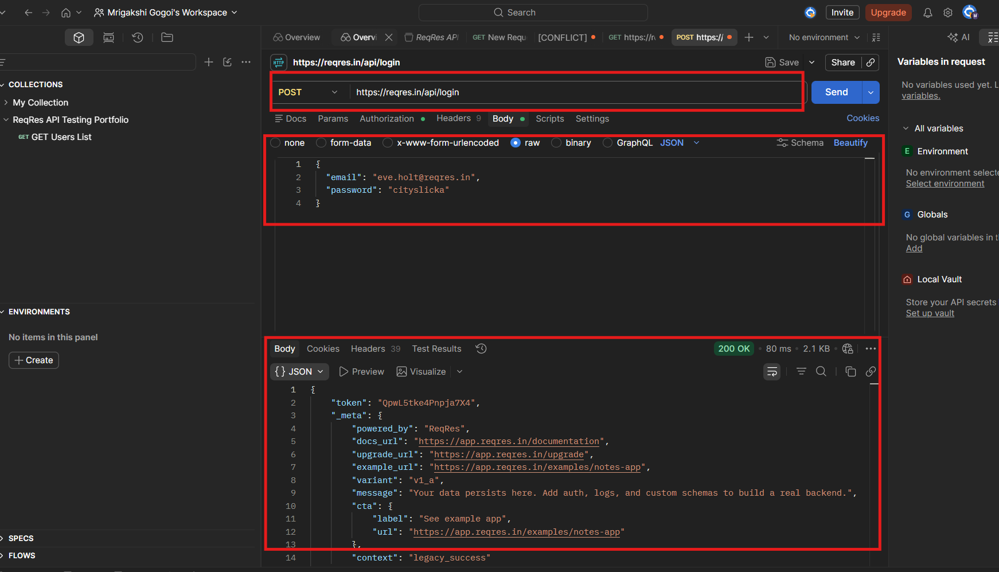
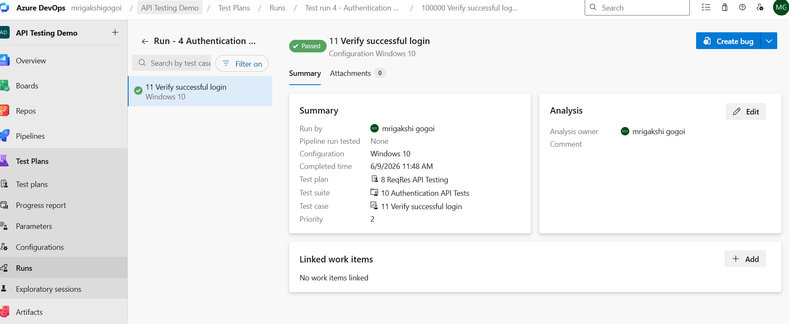

---
## Test Execution – Verify Invalid Credentials

### Test Case ID

TC002

### Test Case Name

Verify Invalid Credentials

### Objective

Verify that the login API rejects invalid user credentials and returns an appropriate error response.

### Tool Used

* Postman
* Azure DevOps Test Plans

### API Endpoint

```http
POST https://reqres.in/api/login
```

### Request Headers

```http
x-api-key: --
Content-Type: application/json
```

### Test Data

#### Request Payload

```json
{
  "email": "invalid@test.com",
  "password": "wrongpassword"
}
```

### Test Steps

| Step | Action                            | Expected Result                       |
| ---- | --------------------------------- | ------------------------------------- |
| 1    | Open ReqRes Login API endpoint    | Endpoint is accessible                |
| 2    | Send POST request to `/api/login` | Request is accepted by the server     |
| 3    | Enter invalid email address       | Email is processed                    |
| 4    | Enter invalid password            | Password is processed                 |
| 5    | Submit the request                | Login attempt is rejected             |
| 6    | Verify response                   | Appropriate error message is returned |

### Expected Result

* Status Code = 400 Bad Request
* Error message is returned
* Authentication token is not generated

### Actual Result

* Status Code = 400 Bad Request
* Error response returned by API
* Authentication token was not generated

### Outcome

**PASS**

The API correctly rejected invalid credentials and returned an appropriate error response, matching the expected behavior.

### Evidence

#### Postman Execution

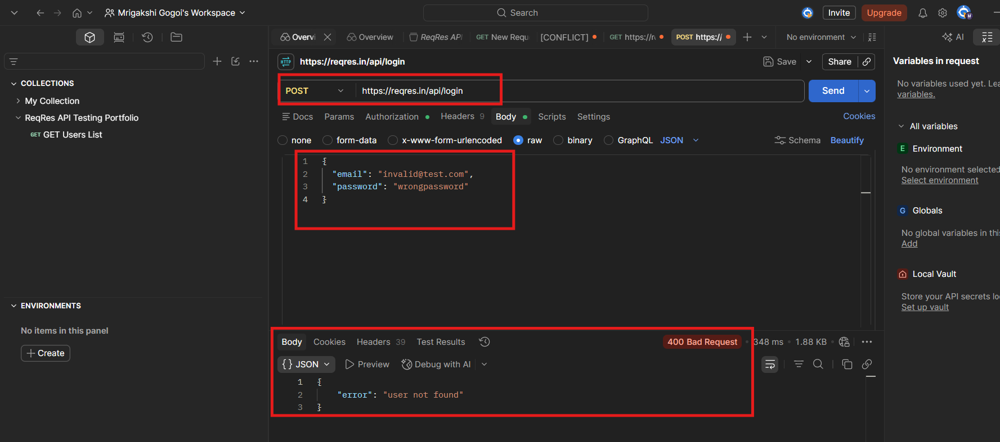

#### Azure Test Plans Execution
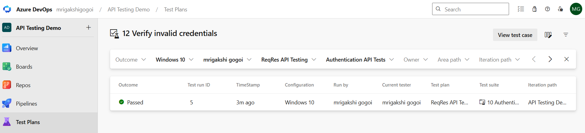

### Key Learning

* Negative API testing
* Error handling validation
* Response verification
* Authentication failure testing
* Azure DevOps Test Execution

---
# Azure DevOps Defect Tracking

Sample defect created to demonstrate Azure DevOps defect management workflow.

During user creation API validation, an invalid job title format was submitted.

Impact:
Invalid user data may be stored in the system.

Test executed using Postman.

Invalid job title format was submitted in the Create User API request.

Expected Result:
The API should validate the job field and reject invalid formats.

Actual Result:
The API accepted the invalid job title and returned HTTP 201 Created.

Outcome:
FAIL

Bug created to demonstrate Azure DevOps defect tracking and test-to-defect traceability.

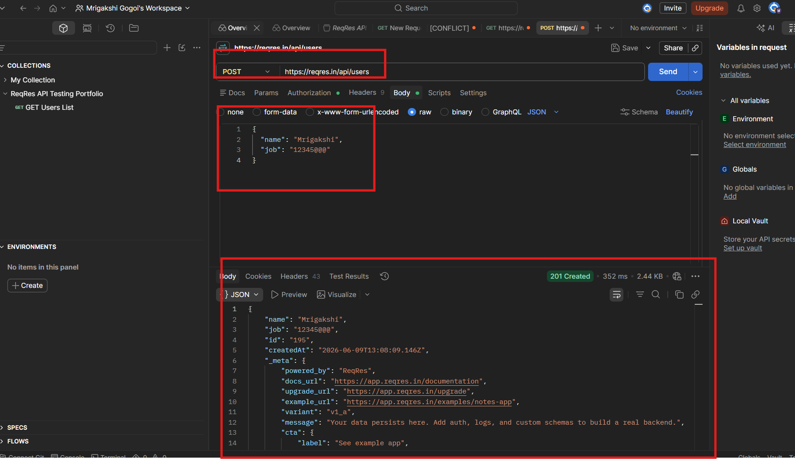

---

# Bug Details

Detailed defect information was maintained to support issue resolution.

## Information Captured

* Bug Title
* Description
* Reproduction Steps
* Severity
* Priority
* Expected Result
* Actual Result
* Status
* Assignee

## Screenshot

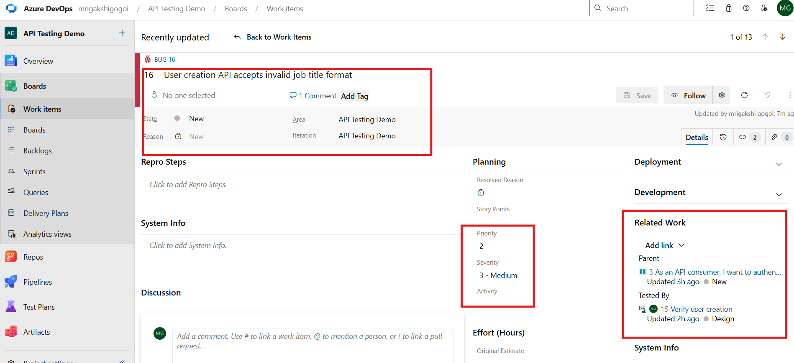

Note: The defect was created for demonstration purposes to showcase Azure DevOps bug tracking, defect lifecycle management, and traceability.

---

## Azure Boards Integration

User Stories were created and linked with testing activities to establish requirement traceability.

### User Story Example

**Title**
User Login Functionality

**Description**

As an API consumer,

I want to authenticate successfully

So that I can access protected resources securely.

### Testing Traceability

The User Story was linked to:

* Verify successful login
* Verify invalid credentials
* Verify user creation

This ensures that business requirements can be traced to test cases and validation activities.

### Screenshot

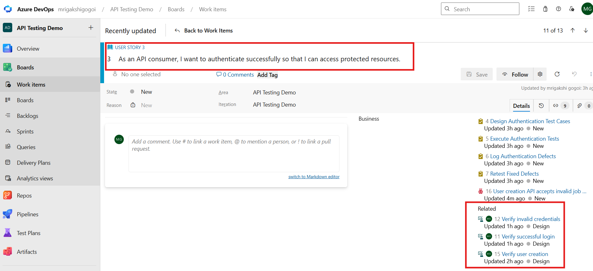

### Key Learning

* Azure Boards Work Item Management
* Requirement Traceability
* User Story to Test Case Mapping
* Agile Testing Practices


---

## Requirement Traceability

Requirements were linked to test cases and defects to ensure complete validation coverage and quality assurance.

### Traceability Flow

User Story
↓
Test Case
↓
Test Run
↓
Bug
↓
Retest
↓
Closed

### Example

**User Story**
As an API consumer,
I want to authenticate successfully,
so that I can access protected resources.

**Associated Test Cases**

* Verify successful login
* Verify invalid credentials
* Verify user creation

**Associated Defect**

* User creation API accepts invalid job title format

### Benefits

* Requirement coverage
* Audit readiness
* Impact analysis
* Better quality assurance
* End-to-end traceability

### Screenshots

* User Story Traceability
* Test Run Results
* Defect Linked to Test Case


## Screenshot

Screenshot A
User Story showing related tasks.
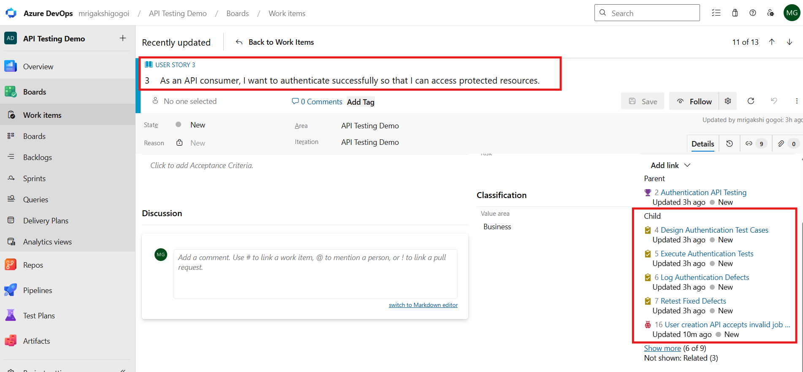

Screenshot B
Test Run showing Pass/Fail results.
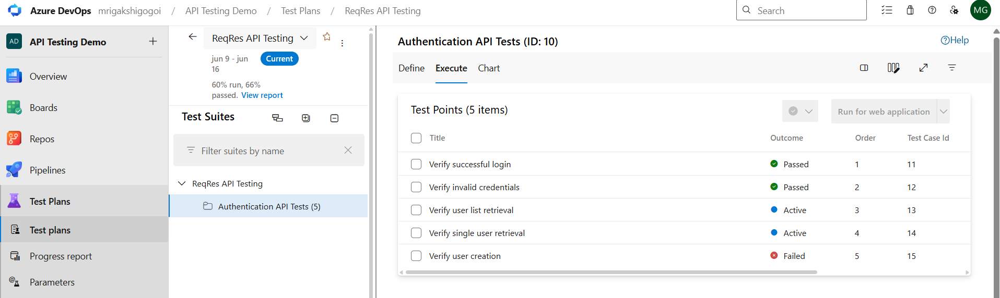

Screenshot C
Bug showing linked Test Case.
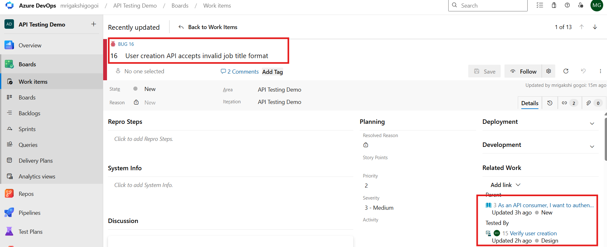

---

## Jira Defect Management

Jira Software was used to demonstrate Agile defect management and Kanban-based workflows.

### Activities Performed

* Created Jira workspace
* Created User Story
* Managed backlog items
* Created testing tasks
* Logged defects
* Prioritized issues
* Managed defect lifecycle
* Used Kanban Board workflow

### Workflow Demonstrated

User Login Functionality (Story)

↓

Design Authentication Test Cases (Task)

↓

Execute Authentication Tests (Task)

↓

User creation API accepts invalid job title format (Bug)

↓

Defect Resolution (Done)

### Sample Defect

**Issue ID:** KAN-7

**Title:** User creation API accepts invalid job title format

**Status:** Done

### Benefits

* Agile work tracking
* Defect lifecycle management
* Visual workflow management
* Team collaboration
* Requirement traceability

### Screenshot

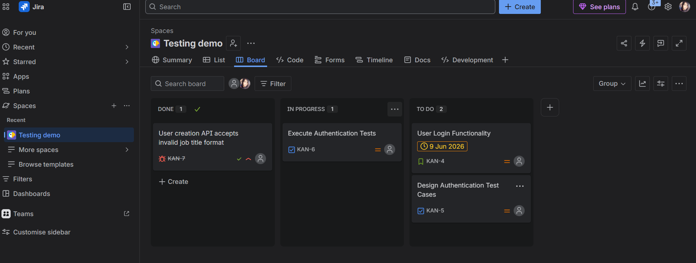


---

# Jira Backlog Management

The Jira backlog was used to manage testing-related activities.

## Work Items

* Stories
* Tasks
* Bugs
* Testing Activities

## Screenshot

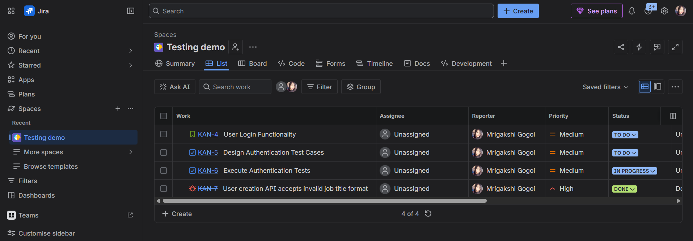

---

# Jira Defect Creation

## Jira Defect Creation

Defects were created and tracked through their lifecycle using Jira Software.

### Sample Jira Defect

| Field    | Value                                              |
| -------- | -------------------------------------------------- |
| Bug ID   | KAN-7                                              |
| Title    | User creation API accepts invalid job title format |
| Priority | High                                               |
| Severity | Medium                                             |
| Status   | Done                                               |


## Jira Defect Creation

Defects were created and tracked through their lifecycle using Jira Software.

### Sample Jira Defect

| Field | Value |
|---------|---------|
| Bug ID | KAN-7 |
| Title | User creation API accepts invalid job title format |
| Priority | High |
| Severity | Medium |
| Status | Done |

### Defect Description

During API testing, an invalid job title format was submitted to the Create User endpoint.

**Expected Result**

The API should validate the job field and reject invalid formats.

**Actual Result**

The API accepted the invalid job title value and returned HTTP 201 Created.

### Defect Lifecycle

Open

↓

In Progress

↓

In Review

↓

Done

### Outcome

The defect was tracked through the Jira workflow to demonstrate defect lifecycle management, issue prioritization, and Agile defect tracking practices.

### Screenshot

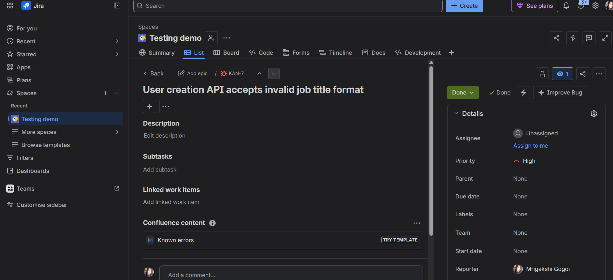

### Key Learning

- Jira Defect Management
- Bug Prioritization
- Defect Lifecycle Tracking
- Agile Issue Management
- Kanban Workflow


---

# Jira Agile Board

Kanban board used for tracking defect progress.

## Workflow Stages

```text
To Do
 ↓
In Progress
 ↓
Testing
 ↓
Done
```

## Screenshot

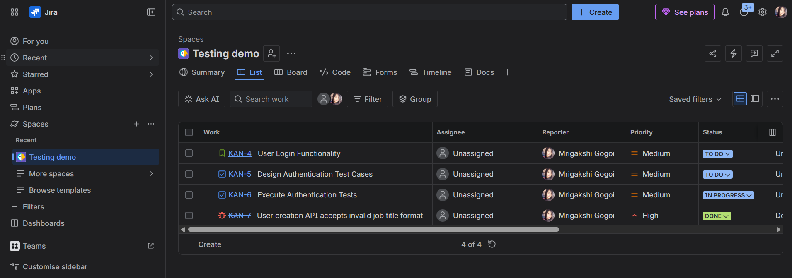

---

# Jira Defect Lifecycle

Defects were tracked from creation through closure.

## Lifecycle

```text
Open
 ↓
In Progress
 ↓
Ready for Testing
 ↓
Closed
```

## Screenshot

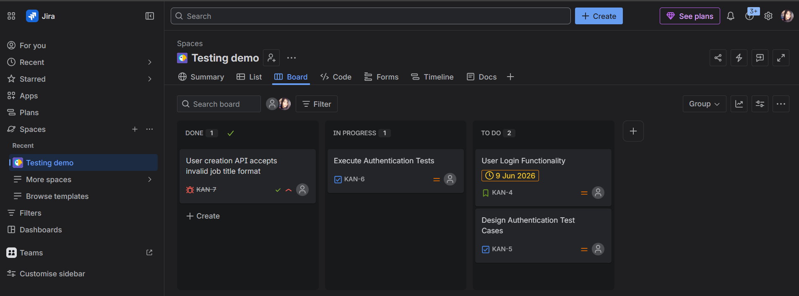

---

# End-to-End Testing Workflow

```text
Requirement
      ↓
Azure DevOps User Story
      ↓
Test Plan
      ↓
Test Suite
      ↓
Test Case
      ↓
Test Execution
      ↓
Defect Identification
      ↓
Jira Bug Creation
      ↓
Developer Fix
      ↓
Retesting
      ↓
Closure
```

---

# Skills Demonstrated

* Azure DevOps
* Azure Test Plans
* Azure Boards
* Jira Software
* Manual Testing
* Test Case Design
* Test Execution
* Defect Tracking
* Bug Lifecycle Management
* Requirement Traceability
* Agile Methodology
* Kanban
* Scrum
* Software Quality Assurance
* ISTQB Testing Practices

---

# Key Learnings

* Test Planning and Management
* Test Suite Organization
* Manual Test Execution
* Defect Reporting
* Azure DevOps Boards
* Jira Defect Management
* Requirement Traceability
* Agile Testing Processes
* Software Quality Assurance Best Practices

---


# Manual Test Execution

Test cases were executed using Azure DevOps Test Plans.

## Activities Performed

* Execute test cases
* Record Pass/Fail status
* Capture execution evidence
* Add execution comments
* Retest defects

## Screenshot


---

# Test Results

Execution results were recorded and tracked.

## Test Execution Summary

| Metric           | Value |
| ---------------- | ----- |
| Total Test Cases | 10    |
| Passed           | 8     |
| Failed           | 2     |
| Blocked          | 0     |

## Screenshot


---

# Azure DevOps Defect Tracking

Defects identified during testing were logged in Azure Boards.

## Sample Bug

### Bug ID

```text
BUG001
```

### Title

```text
Login button not responding
```

### Severity

```text
High
```

### Priority

```text
High
```

### Steps to Reproduce

1. Open Login Page
2. Enter credentials
3. Click Login

### Expected Result

User successfully logs in.

### Actual Result

No action occurs.

## Screenshot


---

# Bug Details

Detailed defect information was maintained to support issue resolution.

## Information Captured

* Bug Title
* Description
* Reproduction Steps
* Severity
* Priority
* Expected Result
* Actual Result
* Status
* Assignee

## Screenshot


---

# Azure Boards Integration

User Stories were created and linked with testing activities.

## User Story Example

### Title

```text
User Login Functionality
```

### Description

As a user,

I want to log into the application

So that I can access my account securely.

## Screenshot


---

# Requirement Traceability

Requirements were linked to test cases and defects.

## Traceability Flow

```text
User Story
      ↓
Test Case
      ↓
Test Run
      ↓
Bug
      ↓
Retest
      ↓
Closed
```

## Benefits

* Requirement coverage
* Audit readiness
* Impact analysis
* Better quality assurance

## Screenshot


---

# Jira Defect Management

Jira Software was used to demonstrate defect management and Agile workflows.

## Activities Performed

* Created Jira Project
* Managed Backlog
* Created Bugs
* Prioritized Defects
* Managed Bug Lifecycle
* Used Kanban Board

## Screenshot


---

# Jira Backlog Management

The Jira backlog was used to manage testing-related activities.

## Work Items

* Stories
* Tasks
* Bugs
* Testing Activities

## Screenshot


---

# Jira Defect Creation

Defects were created and tracked through their lifecycle.

## Sample Jira Defect

### Bug ID

```text
BUG-101
```

### Title

```text
Login button not responding
```

### Priority

```text
Highest
```

### Severity

```text
High
```

### Status

```text
Open
```

## Screenshot


---

# Jira Bug Details

Detailed bug information was maintained.

## Information Recorded

* Summary
* Description
* Environment
* Steps to Reproduce
* Expected Result
* Actual Result
* Priority
* Severity
* Status

## Screenshot

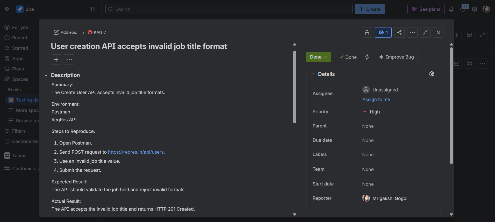

---

# Jira Agile Board

Kanban board used for tracking defect progress.

## Workflow Stages

```text
To Do
 ↓
In Progress
 ↓
Testing
 ↓
Done
```

## Screenshot


---

# Jira Defect Lifecycle

Defects were tracked from creation through closure.

## Lifecycle

```text
Open
 ↓
In Progress
 ↓
Ready for Testing
 ↓
Closed
```

## Screenshot


---

# End-to-End Testing Workflow

```text
Requirement
      ↓
Azure DevOps User Story
      ↓
Test Plan
      ↓
Test Suite
      ↓
Test Case
      ↓
Test Execution
      ↓
Defect Identification
      ↓
Jira Bug Creation
      ↓
Developer Fix
      ↓
Retesting
      ↓
Closure
```

---

# Skills Demonstrated

* Azure DevOps
* Azure Test Plans
* Azure Boards
* Jira Software
* Manual Testing
* Test Case Design
* Test Execution
* Defect Tracking
* Bug Lifecycle Management
* Requirement Traceability
* Agile Methodology
* Kanban
* Scrum
* Software Quality Assurance
* ISTQB Testing Practices

---

# Key Learnings

* Test Planning and Management
* Test Suite Organization
* Manual Test Execution
* Defect Reporting
* Azure DevOps Boards
* Jira Defect Management
* Requirement Traceability
* Agile Testing Processes
* Software Quality Assurance Best Practices

---

# Author

**Mrigakshi Gogoi**

### Certifications

* Microsoft Certified: Azure Fundamentals (AZ-900)
* Microsoft Certified: Azure Administrator Associate (AZ-104)
* ISTQB Certified Tester Foundation Level (CTFL)

This repository was created to demonstrate practical experience in Azure DevOps Test Management, Jira Defect Tracking, Agile Testing, and Software Quality Assurance processes.
